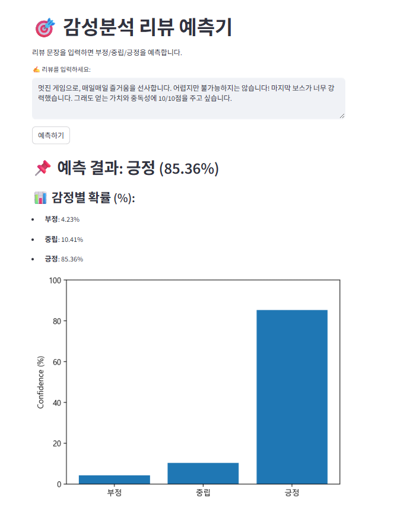
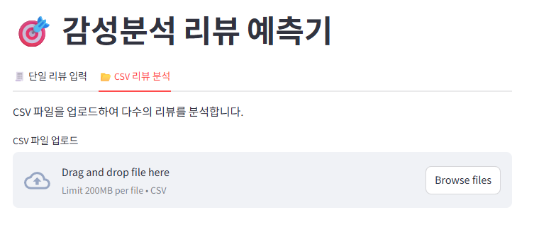
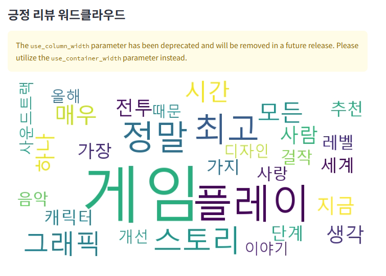
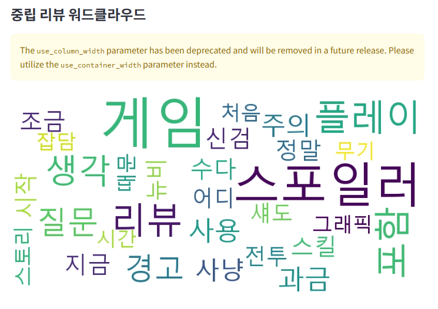
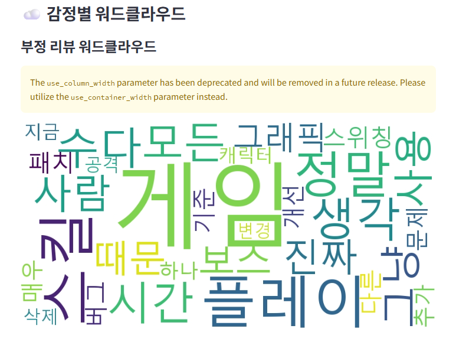

# 🎯 감성분석 리뷰 예측기 (Sentiment Analysis Web App)

텍스트 리뷰를 입력하면 부정 / 중립 / 긍정 중 하나로 예측하는 Streamlit 기반 웹 애플리케이션입니다.  
딥러닝 모델(LSTM + BiLSTM)을 로드하여, 실시간 예측 결과를 확률과 함께 시각화합니다.

---

## 📌 기능

- 사용자 입력 리뷰 → 감성 예측 (부정 / 중립 / 긍정)
- 예측 결과 + 확률 바 차트 시각화
- 한글 텍스트 완벽 지원

## 📸 예시 화면

> 리뷰: `멋진 게임으로, 매일매일 즐거움을 선사합니다. 어렵지만 불가능하지는 않습니다! 마지막 보스가 너무 강력했습니다. 그래도 얻는 가치와 중독성에 10/10점을 주고 싶습니다.`






---

## 🖥️ 실행 방법

### 1. 필수 패키지 설치
```bash
pip install -r requirements.txt
```

### 2. Streamlit 앱 실행
```bash
streamlit run Sentiment_analysis_app.py
```
🧠 사용된 모델
Architecture: Embedding → BiLSTM → Dropout → Dense(softmax)

Loss Function: Categorical CrossEntropy

Tokenizer: Keras Tokenizer (저장 및 불러오기)

모델: https://drive.google.com/file/d/1FqGmrZoQjO-gcSPZoKXs7XMgSX-8qs_U/view?usp=drive_link

Tokenizer: [game_review_sentiment.pkl](https://drive.google.com/file/d/1u94r_rzMJrRfxQf-42b7RvXGHknVlEYR/view?usp=drive_link)

### 3. 주의사항 또는 에러 해결 팁 (선택사항)

## ⚠️ 실행 시 주의사항

- GPU 환경에서 실행 시 `out of memory` 오류가 발생하면, Streamlit 코드 상단에 아래 코드 추가:
```python
import tensorflow as tf
gpus = tf.config.experimental.list_physical_devices('GPU')
if gpus:
    for gpu in gpus:
        tf.config.experimental.set_memory_growth(gpu, True)
```

matplotlib 한글 깨짐 문제는 다음 코드로 해결:

```python
import matplotlib.pyplot as plt
plt.rcParams['font.family'] = 'Malgun Gothic'  # Windows
plt.rcParams['axes.unicode_minus'] = False
```

### 4. ✅ 📃 라이선스

```markdown
## 📃 라이선스

이 프로젝트는 MIT 라이선스를 따릅니다.  
자유롭게 사용, 수정, 배포하되, 출처를 표기해 주세요.
